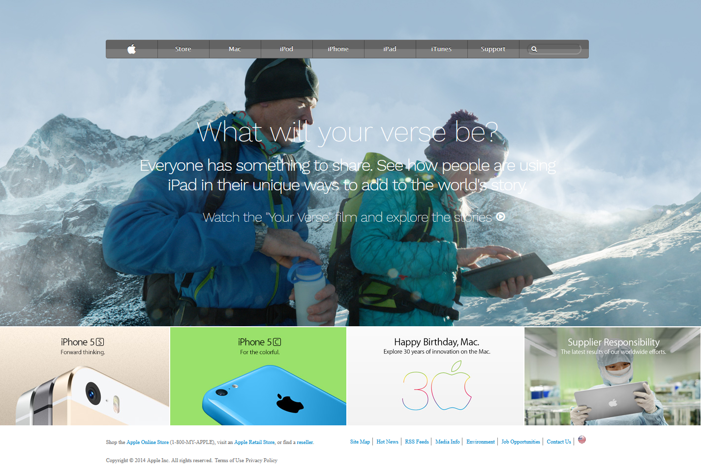

# Apple-clone

> This is a clone page of an [old version](https://web.archive.org/web/20140301004610/http://www.apple.com/) of [apple.com](www.apple.com). Based on [this project](https://www.theodinproject.com/courses/html5-and-css3/lessons/building-with-backgrounds-and-gradients) by [The Odin Project](https://www.theodinproject.com/home). 

## Built With

- HTML,
- CSS (SCSS)

## Live Demo

[Live Demo Link](https://matheus-fls.github.io/Apple-clone/)

## Author

**Matheus Silva**

- Github: [@matheus-fls](https://github.com/matheus-fls)
- Twitter: [@Matheus06600798](https://twitter.com/Matheus06600798)
- Linkedin: [Matheus F. Lopes da Silva](https://www.linkedin.com/in/matheus-f-lopes-da-silva-05610a107/)

## 🤝 Contributing

Contributions, issues and feature requests are welcome!

Feel free to check the [issues page](https://github.com/matheus-fls/Apple-clone/issues).

## Show your support

Give a ⭐️ if you like this project!

## Acknowledgments

- Lots of thanks to Maria Ada for the great feedback .

## 📝 License

This project is [MIT](lic.url) licensed.
